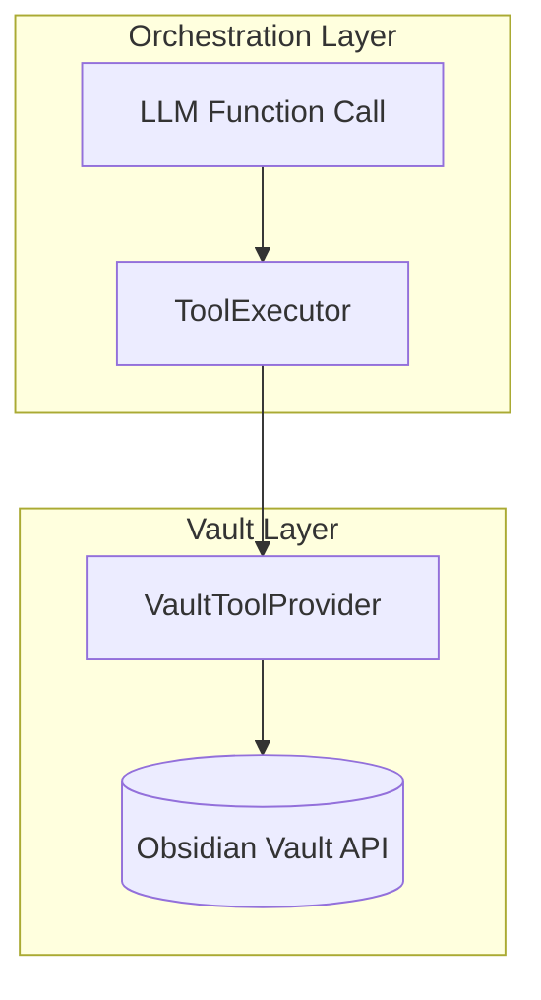
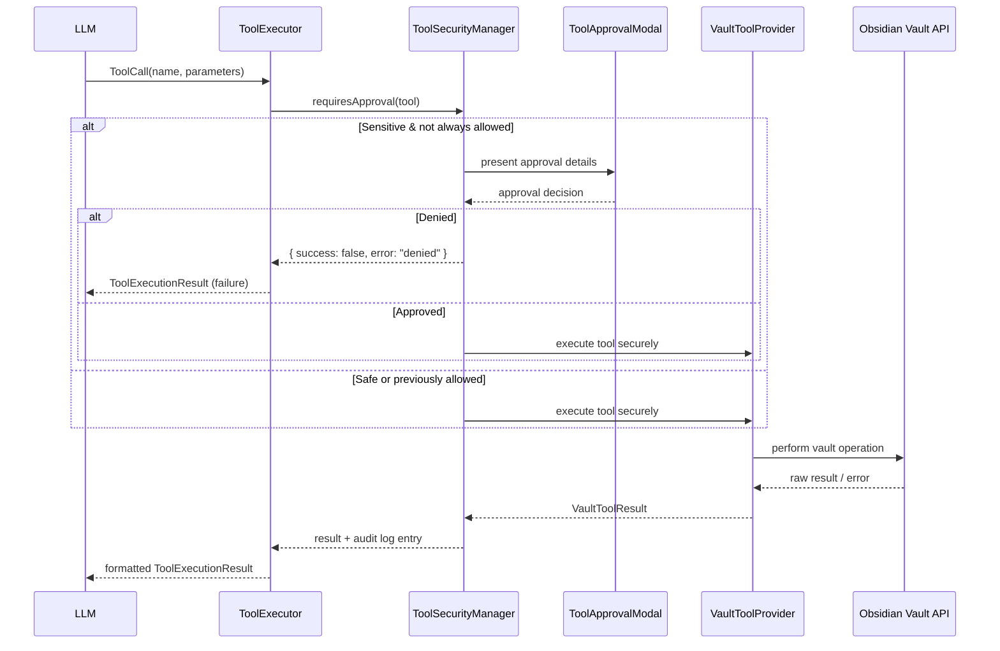

# MCP Package Low-Level Design

## Scope
- Document the internal structure of the `src/mcp` package powering the Copilot vault tooling layer.
- Clarify component responsibilities, data contracts, and execution paths for LLM-triggered tool calls.
- Provide diagrams for architecture context and runtime sequencing.

---

## Component Overview

### 1. `VaultToolProvider`
- Registers the catalog of `VaultTool` definitions (safe read-only vs. sensitive write operations).
- Validates runtime parameters against `VaultToolParameter` metadata and dispatches to concrete vault helpers.
- Wraps Obsidian's `app.vault` API to implement CRUD/search/statistics utilities and normalizes results to `VaultToolResult`.

### 2. `ToolSecurityManager`
- Persists per-tool permissions (`toolPermissions`) and audit entries (`toolAuditLog`) using the plugin's data store.
- Determines whether a tool call requires user approval (safe tools auto-run, sensitive ones may be auto-approved if "always allow" is set).
- Hosts `ToolApprovalModal`, which previews the requested action, captures approval choices, and logs the decision.

### 3. `ToolExecutor`
- Public façade exposed to the LLM orchestration layer.
- Translates LLM function metadata into JSON Schema, parses tool calls, sequences execution, and aggregates results.
- Delegates enforcement to `ToolSecurityManager` and actual vault operations to `VaultToolProvider`.
- Emits diagnostics (LLM-formatted results, stats, help text) and supports demo/test calls for sanity checks.

---

## Architecture Diagram

---

## Key Data Contracts

| Interface | Description | Key Fields |
|-----------|-------------|------------|
| `VaultTool` | Declarative tool definition consumed by both the LLM schema generator and execution switch | `name`, `description`, `parameters`, `safe` |
| `VaultToolParameter` | Runtime validation metadata for each argument | `name`, `type`, `required`, `default` |
| `VaultToolResult` | Unified result envelope returned by all tools | `success`, `data`, `error`, `message` |
| `ToolCall` | Parsed LLM invocation that `ToolExecutor` consumes | `name`, `parameters`, `context` |
| `ToolExecutionResult` | Extends `VaultToolResult` with orchestration metadata | `toolName`, `executionTime`, `requiresApproval`, `approved` |
| `ToolPermission` | Persisted approval state per tool | `allowed`, `alwaysAllow`, `timestamp` |
| `ToolExecutionRequest` | Payload displayed in approval modal | `tool`, `parameters`, `requestId`, `timestamp` |

---

## Runtime Sequence

---

## Control Flows

### Tool Registration & Schema Exposure
1. `VaultToolProvider` constructor calls `initializeTools`, explicitly registering each tool via `registerTool`.
2. `ToolExecutor.getToolsForLLM` converts `VaultTool.parameters` into JSON Schema to expose through the function-calling API.

### Tool Execution
1. `ToolExecutor.executeTool` fetches the `VaultTool`, validates existence, and timestamps the run.
2. `ToolSecurityManager.executeToolSecurely` gates the call, optionally opening `ToolApprovalModal`.
3. Approved executions delegate back to `VaultToolProvider.executeTool`, which validates arguments before routing to helper methods (`readFile`, `searchFiles`, etc.).
4. Results propagate back with security logging and user notices for sensitive successes.

### Multi-Tool Orchestration
- `ToolExecutor.executeMultipleTools` runs calls sequentially, bailing early when a denial occurs to avoid cascading risky operations.

---

## Security & Auditing
- **Permission Model:** Safe tools bypass approval; sensitive tools require explicit confirmation unless "always allow" is recorded in `ToolPermission`.
- **Audit Trail:** Every approval, denial, success, failure, or error is appended to the in-memory log and persisted (capped at 1000 entries) for diagnostics and settings views.
- **User Warnings:** Modal previews highlight file paths, content sizes, and destructive actions with warning badges to prevent accidental approvals.

---

## Extension Considerations
1. **New Tools:** Add entries in `initializeTools`, implement corresponding switch branches and helper methods, optionally extend the modal preview.
2. **Additional Security Policies:** Augment `requiresApproval` for contextual rules (e.g., directory allowlists) or embed rate limiting based on audit log analysis.
3. **Metrics/UI:** Leverage `ToolExecutor.getToolStats` to surface per-tool success rates, recent activity, or permission states inside plugin settings.
4. **Batching/Atomicity:** Future enhancements could chain tool calls transactionally and roll back on downstream failures.

---

## File References
- Core logic: `src/mcp/ToolExecutor.ts`, `src/mcp/ToolSecurityManager.ts`, `src/mcp/VaultToolProvider.ts`
- UI modal: `ToolApprovalModal` inside `ToolSecurityManager.ts`
- Settings integration: plugin data stored via `CopilotPlugin.loadData/saveData`
